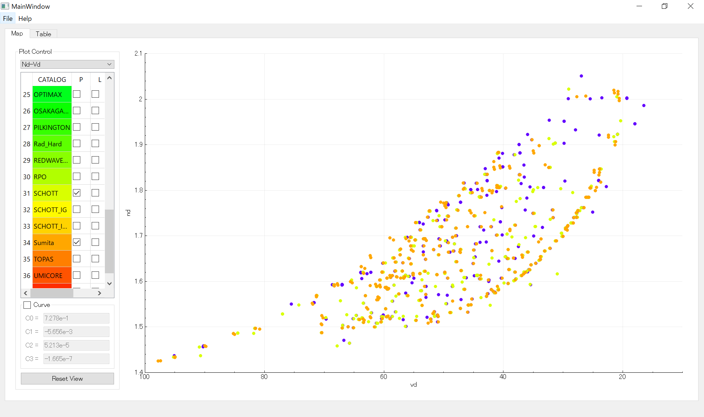

# GlassPlotter

## Overview
GlassPlotter is a open source, desktop glass map viewer.  This application aims to be a comprehensive glass catalog explorer which would be helpful for diverse optical engineers.

## Key Features
- Overlay glass maps from multiple supplyers
- Plot user defined curve on the glass map
- Plot dispersion, internal transmittance of the selected glass

## Getting Started
Binary packages can be downloaded in [Release page](https://github.com/heterophyllus/glassplotter/releases).

## Resources
This application extracts glass data from Zemax AGF file.  Each of AGF files is available in the supplyer's web site. If Zemax has been installed to the computer, AGF files are supposed to be contained in the folder like Documents/Zemax/Glasscat.

## Development
This application is built with:
- [Qt and QtCreator](https://www.qt.io) : GUI library and IDE
- [QCustomPlot](https://www.qcustomplot.com) : Graph plotting library
- [spline](https://github.com/ttk592/spline) : cubic spline library
  

## License
This project is licensed under the GPL License - see the [LICENSE](LICENSE.md) for details.

## Contribution
Contributions and feedbacks are always welcome.

## Acknowledgement
This project got inspiration from the following repositories.

- [mjhoptics/opticalglass](https://github.com/mjhoptics/opticalglass) :
  glass map viewer with simple GUI, written in python.
- [nzhagen/zemaxglass](https://github.com/nzhagen/zemaxglass) : python suite to utilize Zemax glass data.
