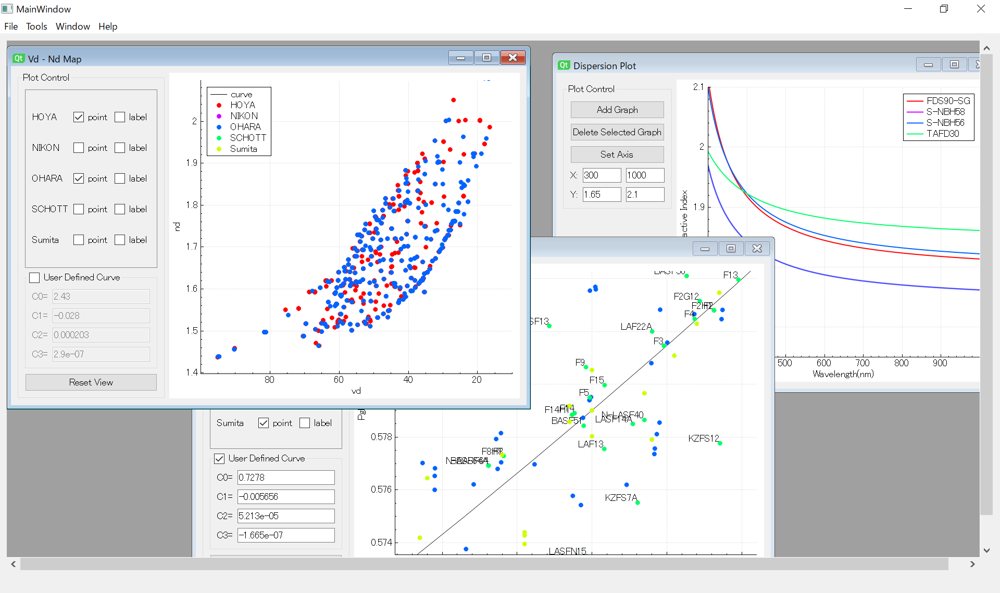

# GlassPlotter - Simple Glassmap Viewer

## Overview
GlassPlotter is an open source, desktop glass map viewer.  This application is capable of visualizing Abbe diagram, plotting property curves and showing datasheets. It aims to be useful for daily work of diverse optical engineers.

## Key Features
- Overlay viewing of glassmaps
  - We, optical designers, eager to find the best material to satisfy the target function.  This application helps us with searching optical glasses from different suppliers.
- Support User Defined Curve
  - Each of the suppliers defines its own "normal line", which confuses us in comparing glasses.  This application displays the glass properties on the same basis.
- Easy to use
  - Optical engineers are not always familiar with programming.  GlassPlotter is a stand-alone application with good-looking GUI.
  
## Getting Started 
Executable binaries for Windows/Mac can be downloaded in [Release page](https://github.com/heterophyllus/glassplotter/releases).

See also [Wiki](https://github.com/heterophyllus/glassplotter/wiki) to get how to use and other information.

## Resources
This application extracts glass data from Zemax AGF files.  Each of AGF files is available on the respective supplier's web site. If Zemax has been installed to the computer, they might be contained in the folder like Documents/Zemax/Glasscat.

Note that the AGF files included in this repository are not always up to date.

## Development
This application is built with:
- [Qt and QtCreator](https://www.qt.io) : GUI library and IDE
- [QCustomPlot](https://www.qcustomplot.com) : Graph plotting library
- [spline](https://github.com/ttk592/spline) : Cubic spline interpolation library
  
## License
This project is licensed under the GPLv3 License - see the [LICENSE](LICENSE.md) for details.

## Contribution
Contributions and feedbacks are greatly appreciated.

