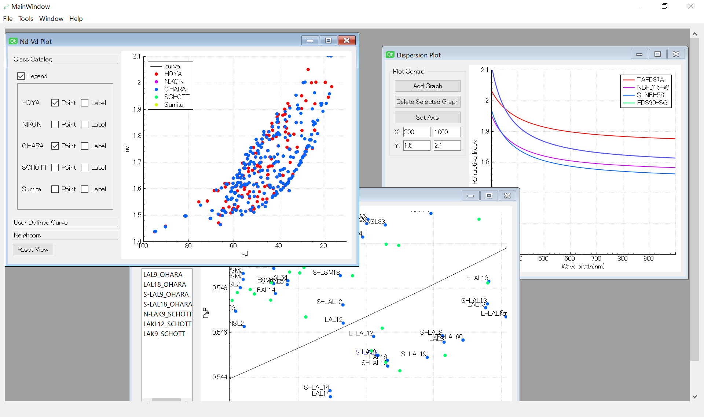

# GlassPlotter

## Overview
GlassPlotter is an open source, easy to use, desktop glass property viewer.  This application is capable of plotting glass maps, dispersion graphs and internal transmittance curves.  GlassPlotter aims to be an comprehensive glass catalog explorer which would be useful for diverse optical engineers.

## Key Features
- Multi Document Interface allows flexible viewing
- Interactive glass map view using the mouse control
- Support dispersion plot, internal transmittance plot

## Demo

## Getting Started

0. Download  
Binary packages can be downloaded in [Release page](https://github.com/heterophyllus/glassplotter/releases).

1. Load AGF  
 What you have to do first after launching is to load AGF files. Go to "File->load AGF" and then select desirable AGF files.

2. Plotting  
 Clicking action in "Tools" menu creates subwindow to view and control plotting.

## Resources
This application extracts glass data from Zemax AGF file.  Each of AGF files is available in the supplyer's web site. If Zemax has been installed to the computer, AGF files might be contained in the folder like Documents/Zemax/Glasscat.

Please be careful that AGF files contained this repository are NOT guaranteed to be latest version.

## Development
This application is built with:
- [Qt and QtCreator](https://www.qt.io) : GUI library and IDE
- [QCustomPlot](https://www.qcustomplot.com) : Graph plotting library
- [spline](https://github.com/ttk592/spline) : Cubic spline library
  

## License
This project is licensed under the GPL License - see the [LICENSE](LICENSE.md) for details.

## Contribution
Contributions and feedbacks are always welcome.

## Acknowledgement
This project got inspiration from the following repositories.

- [mjhoptics/opticalglass](https://github.com/mjhoptics/opticalglass) :
  glass map viewer with simple GUI, written in python.
- [nzhagen/zemaxglass](https://github.com/nzhagen/zemaxglass) : python suite to utilize Zemax glass data.
